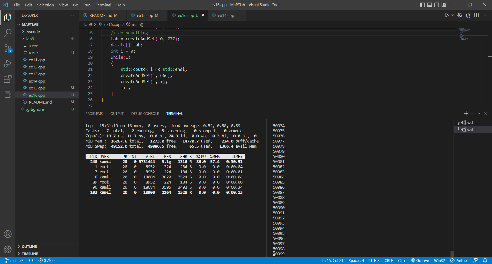

# Lab 9
[source code](https://gitlab.com/kachi_hi/maptlabs)

## ex 1.1
```cpp
#include<iostream>

float thebiggestfloat(float f1, float f2, float f3)
{
    if(f1 >= f2 && f1 >=f3)
        return f1;
    if(f2 >= f1 && f2 >=f3)
        return f2;
    return f3;
}

int main()
{
    float f[3][3] = {
        {1.0, 3.3, 0.3},
        {0.2, 9.99, 0.0},
        {123.11, 231.0, 0.9999}
    };
    for(int i = 0; i < 3; i++)
    {
        std::cout<<thebiggestfloat(f[i][0], f[i][1],f[i][2])<<std::endl;
    }
}
```
```
output:
3.3
9.99
231
```

## ex 1.2
```cpp
#include<iostream>
using namespace std;

int x = 10; // added global variable

void pprint(int x) {
    cout << "1: " << x << endl;
    ++x;
    cout << "2: " << x << endl;
}

int main() {
    int x = 6;

    cout << "0: " << x << endl;
    pprint(x);
    cout << "3: " << x << endl;
}
```
```
output:
0: 6    
1: 6
2: 7
3: 6
```

## ex 1.3
```cpp
#include <iostream>

float clipping(float x)
{
    float min = -25;
    float max = 30;
    if(x > max)
        return max;
    if(x < min)
        return min;
    return x;
}

int main()
{
    double step = 0.10;
    for(double i = -30-step; i < 35.1; i+=step)
    {
        i > -step && i < step ? i = 0: 0;
        std::cout<<clipping(i)<<std::endl;
    }
}
```

## ex 1.4
```cpp
#include<iostream>
using namespace std;

struct Complex{
    float re;
    float im;
};

Complex f(Complex* in){
    Complex result = {in->im, in->re};
    return result;
}

int main(){
    Complex in = {3, 4};
    Complex r = f(&in);

    cout << r.re << endl;
    cout << r.im << endl;
} 
```

## ex 1.5
```cpp
#include <iostream>

struct test
{
    int var1;
    int var2;
};

void setToZero(test *tab, size_t size)
{
    for (size_t i = 0; i < size; ++i)
    {
        tab[i].var1 = 0;
        tab[i].var2 = 0;
    }
}

int main()
{
    test tab1[1000];
    setToZero(tab1, 1000);
}
```

## ex 1.6
```cpp
#include<iostream>
using namespace std;

int *createAndSet(size_t size, int value){
    int *array = new int[size];
    for (size_t i = 0; i < size; ++i ) {
        array[i] = value;
    }
    return array;
}

int main(){
    int *tab;
    tab = createAndSet(10, 666);
    // do something 
    tab = createAndSet(10, 777);
    delete[] tab;
    int i = 0;
    while(1)
    {
        std::cout<< i << std::endl;
        createAndSet(i, 666);
        createAndSet(i, i);
        i++;
    }
}
```

it took around 50k iterations to leave me with just around 1 GB of free memory 




