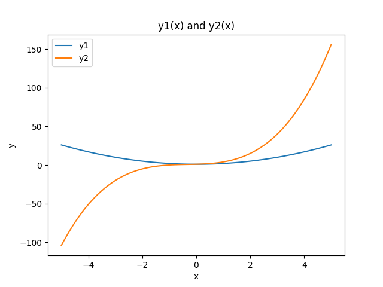
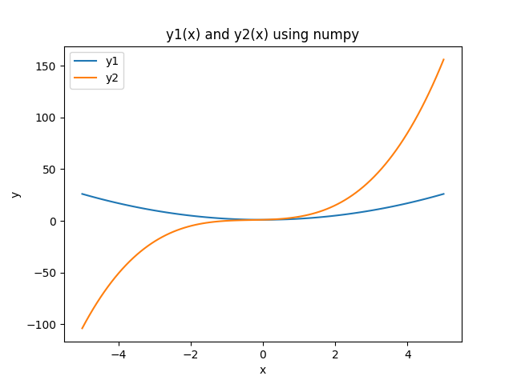

# Laboratory 11
[SOURCE](https://github.com/kamilix2003/MAPT)
## Exercise 1
```py
# word = input()
word = 'Hello world'
reversed_word = ''
# for letter in word:
#     reversed_word = letter + reversed_word
for letter in range(0,len(word)):
    reversed_word = word[letter] + reversed_word
print(reversed_word)
```
```
output:
dlrow olleH
```
## Exercise 2
```py
number = 100
while number <= 150:
    if number%5 == 0 and number%7 == 0:
        number += 1
        continue
    print(number)
    number += 1
```
```
output:
100
101
102
103
104
106
107
108
109
110
111
112
113
114
115
116
117
118
119
120
121
122
123
124
125
126
127
128
129
130
131
132
133
134
135
136
137
138
139
141
142
143
144
145
146
147
148
149
150
```
## Exercise 3
```py
def is_prime(number):
    if number == 2: return True
    for i in range(2, number-1):
        if number%i == 0: return False
    return True

for number in range(2,10,1):
    if is_prime(number): print(number)
else:
    print('all primes in range <2,10>')

given_number = 9
for number in range(2,10,1):
    if is_prime(number) and given_number%number == 0: 
        print(number)
        break
else:
    print(f'first given divisor other than 1 for {given_number} in range <2,10>')
    
```
```
output:
2
3
5
7
all primes in range <2,10>
3
```
## Exercise 4
```py
def factorial(number):
    if number == 1 or number == 0:
        return 1
    else:
        return number * factorial(number-1)
    
# number = int(input())
number = 8
print(factorial(number))
```
```
output:
40320
```
## Exercise 5
```py
import math
class square:
    name = 'square'
    a_ = 0
    C_ = 0
    A_ = 0
    
    def __init__(self,a):
        self.a_ = a

    def area(self):
        return  self.a_ * self.a_
    
    def circumference(self):
        return 4 * self.a_
    
    def display(self):
        if self.A_ != 0 and self.C_ != 0:
            print(f'{self.name} \n   area: {self.A_} \n   circumference: {self.C_}\n')
        print(f'{self.name} \n   area: {self.area()} \n   circumference: {self.circumference()}\n')

class circle:
    name = 'circle'
    r_ = 0
    C_ = 0
    A_ = 0
    
    def __init__(self,r):
        self.r_ = r
        
    def area(self):
        return math.pi * math.pow(self.r_,2)
    
    def circumference(self):
        return 2 * math.pi * self.r_
    
    def display(self):
        if self.A_ != 0 and self.C_ != 0:
            print(f'{self.name} \n   area: {self.A_} \n   circumference: {self.C_}\n')
        print(f'{self.name} \n   area: {self.area()} \n   circumference: {self.circumference()}\n')
    
class triangle:
    name = 'equilateral triangle'
    a_ = 0
    C_ = 0
    A_ = 0
    
    def __init__(self,a):
        self.a_ = a
    
    def area(self):
        return math.sqrt(3)/4 * math.pow(self.a_, 2)
    
    def circumference(self):
        return 3 * self.a_
    
    def display(self):
        if self.A_ != 0 and self.C_ != 0:
            print(f'{self.name} \n   area: {self.A_} \n   circumference: {self.C_}\n')
        print(f'{self.name} \n   area: {self.area()} \n   circumference: {self.circumference()}\n')

sqr = square(5)
cir = circle(5)
tri = triangle(5)
sqr.display()
cir.display()
tri.display()

```
```
output:
square 
   area: 25 
   circumference: 20

circle 
   area: 78.53981633974483 
   circumference: 31.41592653589793

equilateral triangle 
   area: 10.825317547305483 
   circumference: 15

```
## Exercise 6
```py
# filePath = input('Input file path: ')
filePaths = ['File.txt', 'DivideByZero.txt', 'DoesNotExist.txt']

def Do_something(filePath):
    print(f'\nOpenning {filePath}')
    try:
        File = open(filePath)
        nominator = int(File.readline())
        denominator = int(File.readline())
        result = nominator/denominator
        print(f'{nominator} * {denominator} = {result}')
    except FileNotFoundError:
        print('file does not exist')
    except ZeroDivisionError:
        print('Division by zero')
        
for filePath in filePaths:
    Do_something(filePath)
```
```
output:

Openning File.txt
20 * 5 = 4.0

Openning DivideByZero.txt
Division by zero

Openning DoesNotExist.txt
file does not exist
```
## Exercise 7
```py
from Figures import triangle as tr, circle as cir
from Figures.Quadrangles import square as sq

figure1 = tr.triangle(3)
figure2 = cir.circle(5)
figure3 = sq.square(2)

figure3.display()
```
```
output:
square 
   area: 4 
   circumference: 8

```
## Exercise 8
```py
from matplotlib import pyplot
import numpy as np
import math
def y1(x):
    return pow(x, 2) + 1
def y2(x):
    return pow(x, 3) + pow(x, 2) + x + 1
def npy1(X):
    return np.power(X, 2) + 1
def npy2(X):
    return np.power(X, 3) + np.power(X, 2) + X + 1

lower_bound = -5
upper_bound = 5
step = 0.1
steps = (abs(lower_bound) + abs(upper_bound))/step

X = []
Y1 = []
Y2 = []
x = lower_bound
while x <= upper_bound and x >= lower_bound:
    X.append(x)
    Y1.append(round(y1(x), 3))
    Y2.append(round(y2(x), 3))
    x = round(x+step,3)
pyplot.figure('python')
pyplot.plot(X, Y1, X, Y2)
pyplot.title('y1(x) and y2(x)')
pyplot.xlabel('x')
pyplot.ylabel('y')
pyplot.legend(['y1', 'y2'])
pyplot.show()

# numpy part
NPX = np.linspace(lower_bound, upper_bound, int(steps))
NPY1 = npy1(NPX)
NPY2 = npy2(NPX)
pyplot.figure('numpy')
pyplot.plot(NPX, NPY1, NPX, NPY2)
pyplot.title('y1(x) and y2(x) using numpy')
pyplot.xlabel('x')
pyplot.ylabel('y')
pyplot.legend(['y1', 'y2'])
pyplot.show()
```
output:



## Exercise 9
```py
txt = open('text_file.txt')
volwels = ['a', 'e', 'i', 'o', 'u', 'y']
lines = 0
words_per_line = []
volwels_count = 0
lines_to_print = []
for line in txt:
    # print(line)
    print_line = False
    words = line.split(' ')
    words_per_line.append(len(words))
    for word in words:
        for char in word:
            if char.lower() in volwels:
                volwels_count += 1
                if char == char.upper(): print_line = True
    if print_line: lines_to_print.append(line)
    lines = len(words_per_line)
print(f'line count: {lines}')
print(f'words in each line: ')
print(words_per_line)
print(f'volwels in whole text: {volwels_count}')
print(f'lines with upper case volwel {lines_to_print}')

    
```
```
output:
line count: 106
words in each line: 
[4, 4, 11, 5, 4, 12, 4, 5, 12, 5, 5, 11, 4, 4, 13, 2, 2, 4, 8, 4, 4, 6, 5, 8, 7, 11, 4, 5, 12, 5, 5, 10, 4, 5, 6, 6, 6, 8, 7, 9, 5, 5, 6, 7, 5, 4, 8, 6, 4, 5, 4, 3, 5, 3, 4, 6, 4, 5, 4, 3, 5, 3, 4, 7, 4, 4, 7, 3, 2, 5, 8, 1, 5, 6, 4, 6, 5, 5, 5, 2, 4, 3, 4, 5, 5, 5, 7, 1, 6, 4, 4, 4, 3, 5, 3, 4, 6, 4, 5, 4, 3, 5, 3, 4, 4, 5]
volwels in whole text: 970
lines with upper case volwel ['Anything that brain of yours can think of can be found\n', "If none of it's of interest to you, you'd be the first\n", 'And a bunch of colored pencil drawings\n', 'Of all the different characters in Harry Potter fucking each other\n', 'Or send a death threat to a boomer\n', 'Or DM a girl and groom her\n', 'You should kill your mom\n', 'Obama sent the immigrants to vaccinate your kids\n', 'Could I interest you in everything?\n', 'All of the time?\n', 'A little bit of everything\n', 'All of the time\n', "Apathy's a tragedy\n", 'And boredom is a crime\n', 'Anything and everything\n', 'All of the time\n', 'Could I interest you in everything?\n', 'All of the time?\n', 'A little bit of everything\n', 'All of the time\n', "Apathy's a tragedy\n", 'And boredom is a crime\n', 'Anything and everything\n', 'All of the time\n', "You know, it wasn't always like this\n", 'A chat room or two\n', 'You were barely two\n', 'And it did all the things\n', 'Unstoppable, watchable\n', 'Your time is now\n', "Your inside's out\n", 'And if we stick together\n', 'It was always the plan\n', 'Could I interest you in everything?\n', 'All of the time\n', 'A bit of everything\n', 'All of the time\n', "Apathy's a tragedy\n", 'And boredom is a crime\n', 'Anything and everything\n', 'All of the time\n', 'Could I interest you in everything?\n', 'All of the time\n', 'A little bit of everything\n', 'All of the time\n', "Apathy's a tragedy\n", 'And boredom is a crime\n', 'Anything and everything\n', 'And anything and everything\n', 'And anything and everything\n', 'And all of the time']
```
<center> generated with <a href="https://github.com/kamilix2003/report-baker">Report baker</a> </center>